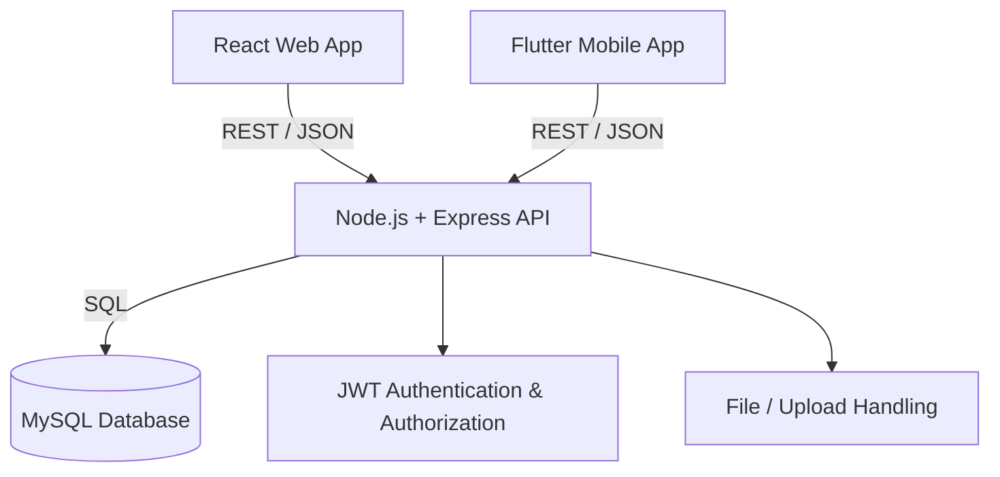

# DartCRM Platform

DartCRM is a full-stack Customer Relationship Management platform with a React web application, a Flutter mobile application, and a shared Node.js/Express REST API backed by MySQL.

> This repository is intended as a portfolio and engineering showcase. Do not commit real customer data, production credentials, private company assets, or secrets.

## Platform Components

| Component | Main technologies | Purpose |
| --- | --- | --- |
| `web/` | React.js, Vite, Redux Toolkit, TanStack Query, Axios | Browser-based CRM interface |
| `mobile/` | Flutter, Dart, Riverpod, Dio/HTTP | Mobile CRM for field and operational workflows |
| `backend/` | Node.js, Express.js, MySQL | Shared REST API, authentication, authorization, business logic and persistence |

## Architecture



Both client applications use the same backend and database, which keeps authentication, business rules and CRM data consistent across web and mobile.

## Main Features

- Authentication and session handling
- Role-based access and administrative user management
- Customer and contact management
- Field visits / DSR workflows
- Attendance and location-aware workflows
- Sampling and self-stock requests
- Multi-level approval and forwarding workflows
- Notifications
- File/document handling
- Request/audit history
- Responsive web interface and Flutter mobile interface

## Repository Structure

```text
DartCRM-Platform/
├── backend/                 # Node.js + Express + MySQL API
├── mobile/                  # Flutter mobile application
├── web/                     # React + Vite web application
├── .github/
│   └── workflows/           # GitHub Actions CI
├── docs/
│   ├── architecture/        # Architecture documentation
│   └── screenshots/         # Portfolio screenshots
├── .gitignore
├── LICENSE
├── README.md
└── SECURITY.md
```

## Getting Started

### Backend

```bash
cd backend
npm install
```

Create your local environment file from the example:

```bash
cp .env.example .env
```

Configure the database and other local values, then run:

```bash
npm run dev
```

Useful checks:

```bash
npm run check
npm test
```

### Web

```bash
cd web
npm install
```

If the project provides `.env.example`, create a local `.env` from it and update the API configuration.

```bash
npm run dev
```

Production checks:

```bash
npm run lint
npm run build
```

### Mobile

```bash
cd mobile
flutter pub get
flutter run
```

For a physical device, configure the API base URL so that the device can reach the backend. Do not commit local or production secrets.

Recommended checks:

```bash
flutter analyze
flutter test        # when tests are present
flutter build apk --release
```

## Environment Files

Real environment files must stay local:

```text
backend/.env      -> do not commit
web/.env          -> do not commit
mobile/.env       -> do not commit
```

Commit only safe templates such as:

```text
backend/.env.example
web/.env.example
mobile/.env.example
```

Never place real passwords, JWT secrets, database credentials, private API keys or signing keys in the repository.

## Continuous Integration

GitHub Actions workflows are included for all three applications:

- `backend-ci.yml` — dependency install, syntax check and backend tests
- `web-ci.yml` — dependency install, ESLint and production build
- `mobile-ci.yml` — Flutter dependency install, analysis, optional tests and release APK build

Each workflow runs only when its application (or its workflow file) changes. Workflows can also be started manually from the GitHub **Actions** tab.

## Screenshots

Add sanitized portfolio screenshots under `docs/screenshots/`. Use demo data only; do not expose real customer, employee, company or authentication information.

See [`docs/screenshots/README.md`](docs/screenshots/README.md) for the recommended screenshot set.

## Architecture Documentation

See [`docs/architecture/system-architecture.md`](docs/architecture/system-architecture.md) for a more detailed overview of the platform flow.

## Security

Please read [`SECURITY.md`](SECURITY.md) before publishing or sharing the repository.

## License

This repository uses a portfolio-source, all-rights-reserved license. See [`LICENSE`](LICENSE) for details.
