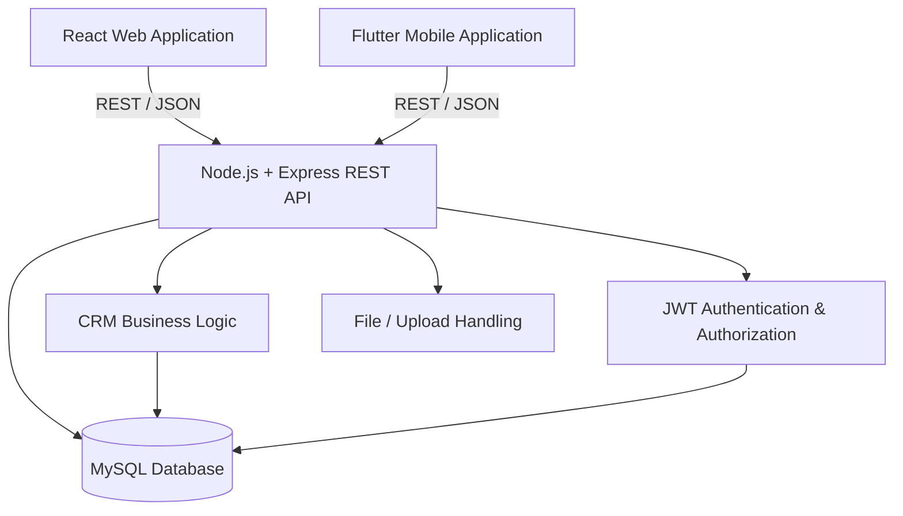

# DartCRM Platform


A full-stack **Customer Relationship Management (CRM) platform** built with React, Flutter, Node.js, Express.js, and MySQL.

DartCRM provides a shared backend for both web and mobile clients and includes customer management, contacts, field visits, attendance, sampling, self-stock requests, approval workflows, notifications, administrative features, file handling, and request history.

The platform demonstrates a multi-client architecture where the **React web application** and **Flutter mobile application** communicate with the same **Node.js/Express REST API** and **MySQL database**.

> **Portfolio Notice:**  
> This repository is intended as a portfolio and engineering showcase. Do not commit real customer data, production credentials, private company assets, authentication secrets, or other sensitive information.

---

## Project Status

| Component | Status | Purpose |
| --- | --- | --- |
| Web Application | ✅ Implemented | Browser-based CRM interface |
| Flutter Mobile Application | ✅ Implemented | Mobile CRM and field workflows |
| Backend REST API | ✅ Implemented | Shared business logic and persistence |
| Backend CI | ✅ Configured | Syntax checks and automated tests |
| Web CI | ✅ Configured | ESLint and production build |
| Mobile CI | ✅ Configured | Analysis, tests and release APK build |

The GitHub Actions badges at the top of this README show the latest CI status for each application.

---

## Platform Components

| Component | Main Technologies | Purpose |
| --- | --- | --- |
| `web/` | React.js, Vite, Redux Toolkit, TanStack Query, Axios | Browser-based CRM interface |
| `mobile/` | Flutter, Dart, Riverpod, Dio / HTTP | Mobile CRM for field and operational workflows |
| `backend/` | Node.js, Express.js, MySQL | Shared REST API, authentication, authorization, business logic and persistence |

---

## Architecture



Both client applications use the same backend and database.

This keeps:

- Authentication consistent
- Authorization rules centralized
- CRM business logic reusable
- Customer data synchronized
- Approval workflows consistent
- Web and mobile clients aligned

### High-Level Request Flow

```text
React Web App
      │
      │ REST API / JSON
      ▼
Node.js + Express Backend
      │
      ├── Authentication
      ├── Authorization
      ├── Validation
      ├── CRM Business Logic
      ├── File Handling
      └── Database Operations
      │
      ▼
MySQL Database
      ▲
      │
      │ REST API / JSON
      │
Flutter Mobile App
```

---

## Main Features

### Authentication & Security

- User authentication
- JWT-based authentication
- Session / token handling
- Refresh-token workflow
- Role-based access control
- Protected API routes
- Administrative user access

### Customer Management

- Customer records
- Customer search
- Customer details
- Customer contacts
- Customer categorization
- School, Trade and Library customer workflows
- Location and geography-related customer data

### Contact Management

- Contact creation
- Contact details
- Contact updates
- Designation-related data
- Customer-contact association

### Field Visits / DSR

- Daily Sales Report workflows
- Field visit planning
- Visit entries
- Customer visit information
- Field activity tracking

### Attendance

- Attendance workflows
- Location-aware attendance functionality
- User attendance records
- Field-user operational workflows

### Sampling

- Customer sampling requests
- School sampling
- Trade sampling
- Library sampling
- Self-stock sampling
- Sampling request details
- Sampling request history

### Approval Workflows

- Multi-level approval workflows
- Request forwarding
- Approval / rejection flows
- Administrative request handling
- Request history and audit tracking

### Notifications

- Application notifications
- Workflow-related notifications
- User-specific notification handling

### Administration

- User management
- Role-based administrative features
- Application setup
- Workflow configuration
- Administrative request management

### File Handling

- File uploads
- Document handling
- Backend upload management

---

## Technology Stack

### Web

- React.js
- Vite
- JavaScript / JSX
- Redux Toolkit
- TanStack Query
- Axios
- React Router
- ESLint
- Responsive UI components

### Mobile

- Flutter
- Dart
- Riverpod
- Dio / HTTP
- Secure local token storage
- Android support
- iOS project support

### Backend

- Node.js
- Express.js
- MySQL
- REST APIs
- JWT authentication
- Middleware-based authorization
- File upload handling
- Validation
- Automated tests

### DevOps / Tooling

- Git
- GitHub
- GitHub Actions
- npm
- Flutter CLI
- Gradle
- Java / JDK

---

## Prerequisites

Before running the complete platform locally, install the required development tools.

### Backend / Web

Recommended:

```text
Node.js 20+
npm
MySQL
Git
```

### Mobile

Current CI environment uses:

```text
Flutter 3.47.5
Dart SDK bundled with Flutter
Java 17
Gradle 8.14
Android Gradle Plugin 8.11.1
Kotlin Gradle Plugin 2.2.21
Android SDK
```

You can verify your Flutter installation with:

```bash
flutter doctor
```

And:

```bash
flutter --version
```

---

## Repository Structure

```text
DartCRM-Platform/
│
├── backend/
│   ├── controllers/
│   ├── routes/
│   ├── middleware/
│   ├── services/
│   ├── config/
│   ├── tests/
│   ├── package.json
│   └── .env.example
│
├── mobile/
│   ├── lib/
│   ├── android/
│   ├── ios/
│   ├── test/
│   ├── pubspec.yaml
│   └── .env.example
│
├── web/
│   ├── src/
│   ├── public/
│   ├── package.json
│   ├── vite.config.js
│   └── .env.example
│
├── .github/
│   └── workflows/
│       ├── backend-ci.yml
│       ├── web-ci.yml
│       └── mobile-ci.yml
│
├── docs/
│   ├── architecture/
│   │   └── system-architecture.md
│   └── screenshots/
│       └── README.md
│
├── .gitignore
├── LICENSE
├── README.md
└── SECURITY.md
```

---

# Getting Started

Clone the repository:

```bash
git clone https://github.com/Amitkv05/DartCRM-Platform.git
```

Enter the project:

```bash
cd DartCRM-Platform
```

The web, backend and mobile applications should be configured separately.

---

# Backend Setup

Move to the backend:

```bash
cd backend
```

Install dependencies:

```bash
npm install
```

If a lockfile is available, you can use:

```bash
npm ci
```

for a reproducible dependency installation.

---

## Backend Environment Configuration

Create a local `.env` file from the provided template.

Linux / macOS:

```bash
cp .env.example .env
```

Windows PowerShell:

```powershell
Copy-Item .env.example .env
```

Configure the required local values such as:

```text
PORT
NODE_ENV

DB_HOST
DB_PORT
DB_USER
DB_PASSWORD
DB_NAME

JWT secrets
Token expiration configuration
CORS configuration
```

Do not commit the generated `.env` file.

---

## Database Setup

DartCRM uses **MySQL** as its primary database.

Before starting the backend:

1. Install and start MySQL.
2. Create a database for DartCRM.
3. Configure the database name and credentials inside `backend/.env`.
4. Import or initialize the required database schema using the SQL/schema setup supplied with the backend project, where applicable.
5. Confirm the backend can successfully connect to MySQL.

Example environment configuration:

```env
DB_HOST=localhost
DB_PORT=3306
DB_USER=your_database_user
DB_PASSWORD=your_database_password
DB_NAME=dartcrm
```

Do not use real production database credentials in a public repository.

---

## Run Backend

Start the development server:

```bash
npm run dev
```

If the project uses a normal start script:

```bash
npm start
```

Useful backend checks:

```bash
npm run check
```

Run automated tests:

```bash
npm test
```

---

# Web Application Setup

Return to the repository root and enter the web project:

```bash
cd web
```

Install dependencies:

```bash
npm install
```

or:

```bash
npm ci
```

when `package-lock.json` is available.

---

## Web Environment Configuration

If `.env.example` is provided:

Linux / macOS:

```bash
cp .env.example .env
```

Windows PowerShell:

```powershell
Copy-Item .env.example .env
```

Configure the API URL so the React application can communicate with the backend.

Example:

```env
VITE_API_BASE_URL=http://localhost:5000/api
```

Use only safe client-side configuration values in Vite environment variables.

> Values exposed through Vite client environment variables are included in the browser bundle and should never contain sensitive server-side secrets.

---

## Run Web Application

```bash
npm run dev
```

Vite will display the local development URL in the terminal.

---

## Web Production Checks

Run ESLint:

```bash
npm run lint
```

Create a production build:

```bash
npm run build
```

The generated production output will normally be available under:

```text
web/dist/
```

---

# Mobile Application Setup

Move into the Flutter application:

```bash
cd mobile
```

Install Flutter dependencies:

```bash
flutter pub get
```

Verify your environment:

```bash
flutter doctor
```

---

## Mobile Environment Configuration

Create:

```text
mobile/.env
```

from:

```text
mobile/.env.example
```

Configure the backend API URL.

For example:

```env
API_BASE_URL=http://192.168.x.x:5000/api
```

When using a physical Android or iOS device, the API URL must point to a backend address reachable from that device.

Using:

```text
localhost
```

inside a physical device normally refers to the device itself, not the development computer.

---

## Run Flutter Application

```bash
flutter run
```

---

## Flutter Analysis

Run:

```bash
flutter analyze
```

The project currently contains legacy code that may produce informational and warning-level analyzer messages.

CI can allow non-fatal informational warnings while still detecting important build failures.

---

## Flutter Tests

Run:

```bash
flutter test
```

The GitHub Actions workflow runs Flutter tests when test files are available.

---

## Build Android Release APK

```bash
flutter build apk --release
```

The generated APK will normally be available at:

```text
mobile/build/app/outputs/flutter-apk/app-release.apk
```

Generated APKs and Flutter build folders should not be committed to Git.

---

# Environment Files

Real environment files must always remain local.

```text
backend/.env
web/.env
mobile/.env
```

These files must **not** be committed.

Safe templates may be committed:

```text
backend/.env.example
web/.env.example
mobile/.env.example
```

Environment templates should contain only placeholder or demo values.

Never commit:

```text
Database passwords
JWT secrets
Private API keys
Production service credentials
Signing keys
Keystore passwords
Real customer credentials
Real employee credentials
Access tokens
Refresh tokens
```

---

# Continuous Integration

DartCRM uses separate GitHub Actions workflows for each application.

```text
.github/workflows/
├── backend-ci.yml
├── web-ci.yml
└── mobile-ci.yml
```

---

## Backend CI

`backend-ci.yml`

Runs when:

```text
backend/**
```

or the Backend CI workflow itself changes.

Pipeline includes:

```text
Checkout repository
        ↓
Setup Node.js
        ↓
Create CI environment
        ↓
Install dependencies
        ↓
JavaScript syntax check
        ↓
Automated backend tests
```

---

## Web CI

`web-ci.yml`

Runs when:

```text
web/**
```

or the Web CI workflow itself changes.

Pipeline includes:

```text
Checkout repository
        ↓
Setup Node.js
        ↓
Install dependencies
        ↓
ESLint
        ↓
Vite production build
```

---

## Mobile CI

`mobile-ci.yml`

Runs when:

```text
mobile/**
```

or the Mobile CI workflow itself changes.

Pipeline includes:

```text
Checkout repository
        ↓
Setup Flutter
        ↓
flutter pub get
        ↓
Flutter analysis
        ↓
Flutter tests
        ↓
Release APK build
```

The workflow can also upload the generated APK as a GitHub Actions artifact when artifact uploading is enabled.

---

## Manual CI Execution

All workflows support manual execution using:

```yaml
workflow_dispatch:
```

To run one manually:

```text
GitHub Repository
        ↓
Actions
        ↓
Select Backend CI / Web CI / Mobile CI
        ↓
Run workflow
        ↓
Select main
        ↓
Run workflow
```

---

# Screenshots

Portfolio screenshots should be stored under:

```text
docs/screenshots/
```

Recommended screenshot categories:

```text
Web Dashboard
Customer Management
Customer Details
Sampling Workflow
Approval Workflow
Attendance
Admin Panel
Mobile Dashboard
Mobile Customer Screen
Mobile Sampling Screen
Mobile Attendance Screen
```

Use only sanitized or demo information.

Do not expose:

- Real customer names
- Phone numbers
- Email addresses
- Employee information
- Passwords
- API tokens
- Production URLs
- Private company information

Example screenshot layout after images are added:

```markdown
### Web Dashboard


### Flutter Mobile Application


```

See:

[`docs/screenshots/README.md`](docs/screenshots/README.md)

for the recommended screenshot set and naming structure.

---

# Architecture Documentation

More detailed platform architecture information is available at:

[`docs/architecture/system-architecture.md`](docs/architecture/system-architecture.md)

The architecture documentation can include:

- Client-server communication
- Authentication flow
- Request lifecycle
- Database interaction
- Web/mobile API sharing
- Approval workflows
- File handling
- Deployment architecture

---

# Security

Security-related recommendations and repository publishing precautions are documented in:

[`SECURITY.md`](SECURITY.md)

Before making the repository public, verify that the Git history does not contain:

```text
.env files
Database credentials
JWT secrets
Private API keys
Access tokens
Signing keys
Keystores
Real customer data
Real employee data
Private company documents
```

If a secret was ever committed, deleting the current file is not sufficient.

Rotate the exposed credential and ensure the secret is removed from repository history when necessary.

---

# Git Ignore Policy

The repository excludes generated and sensitive files such as:

```text
node_modules/
dist/
build/
.dart_tool/
.gradle/
.cxx/
.env
*.apk
*.aab
*.jks
*.keystore
uploads/
IDE-generated files
OS-generated files
```

Generated dependencies and binaries should be recreated during local development or CI instead of being stored in Git.

---

# Development Workflow

A typical contribution flow is:

```text
Create / update feature
        ↓
Run local checks
        ↓
Test functionality
        ↓
Commit changes
        ↓
Push to GitHub
        ↓
GitHub Actions CI
        ↓
Review CI results
```

Recommended local checks before pushing:

### Backend

```bash
npm run check
npm test
```

### Web

```bash
npm run lint
npm run build
```

### Mobile

```bash
flutter analyze
flutter test
flutter build apk --release
```

---

# Portfolio Purpose

DartCRM demonstrates experience working across multiple layers of application development:

```text
Frontend Web Development
        +
Flutter Mobile Development
        +
REST API Development
        +
Authentication & Authorization
        +
Relational Database Integration
        +
Business Workflow Implementation
        +
Testing
        +
Git / GitHub
        +
Continuous Integration
```

The project is structured as a single platform rather than three unrelated applications:

```text
                    DartCRM Platform

          ┌──────────────┴──────────────┐
          │                             │
     React Web                     Flutter Mobile
          │                             │
          └──────────────┬──────────────┘
                         │
                    REST API
                         │
                  Node.js / Express
                         │
                       MySQL
```

---

# Future Improvements

Potential future enhancements include:

- Increase automated backend test coverage
- Increase Flutter unit and widget test coverage
- Add React component and integration tests
- Add end-to-end testing
- Improve Flutter analyzer cleanliness
- Reduce web production bundle size through route-level code splitting
- Add deployment pipelines
- Add Docker support
- Add API documentation using OpenAPI / Swagger
- Add database migration tooling
- Add release automation
- Expand architecture documentation
- Add sanitized demo screenshots
- Add downloadable demo APK through GitHub Releases

---

# License

This repository uses a portfolio-source, all-rights-reserved license.

See:

[`LICENSE`](LICENSE)

for complete licensing information.

---

## Author

**Amit Kumar**

Full-Stack / MERN Stack & Flutter Developer

Technologies demonstrated in this project:

`React.js` · `Flutter` · `Dart` · `Node.js` · `Express.js` · `MySQL` · `REST APIs` · `Redux Toolkit` · `Riverpod` · `GitHub Actions`

---

## Disclaimer

DartCRM is presented as a portfolio and technical demonstration project.

Any demo accounts, sample records, screenshots or environment values included in the repository should contain fictional or sanitized data only.

No real customer, employee, production credential, private company data or confidential information should be published.
