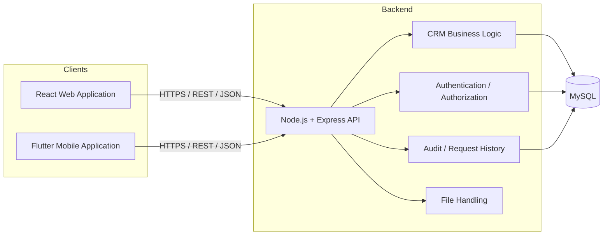
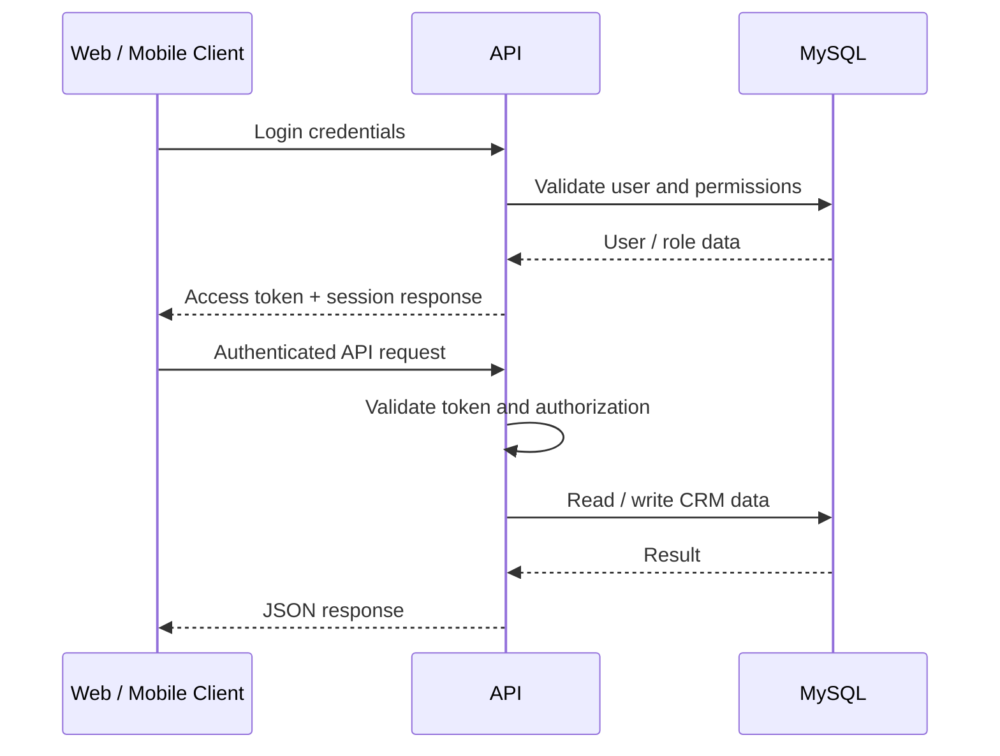

# DartCRM System Architecture

## High-Level Architecture



## Authentication Flow



## Shared Backend Model

The React web application and Flutter mobile application are separate clients of the same backend. Core business rules should remain server-side so that behavior stays consistent across both clients.

```text
React Web -----------\
                      >---- Node.js / Express ---- MySQL
Flutter Mobile ------/
```

## Main Domains

The platform currently covers CRM domains such as customers, contacts, visits, attendance, sampling, self-stock, approvals, notifications, administration and audit/request history.

## Production Notes

- Use HTTPS for production API traffic.
- Keep database credentials, JWT secrets and service credentials server-side.
- Restrict production CORS origins.
- Protect private uploaded files with authentication/authorization where appropriate.
- Use sanitized demo data in public portfolio environments.
- Do not commit signing keys, `.env` files or production database exports.
